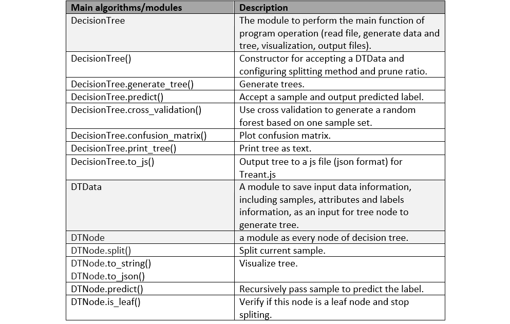
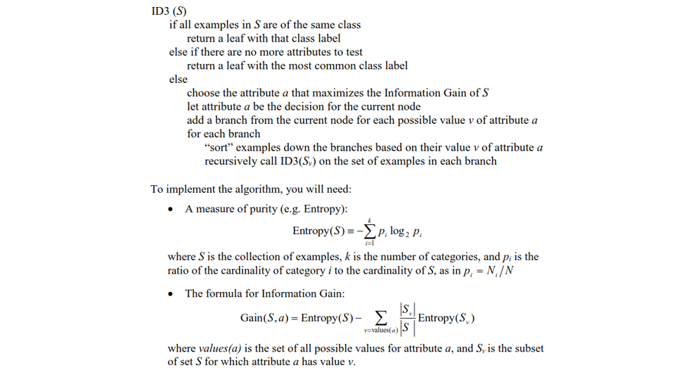
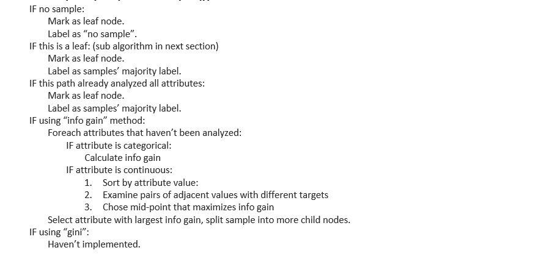
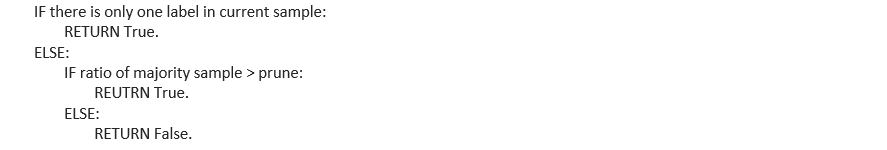
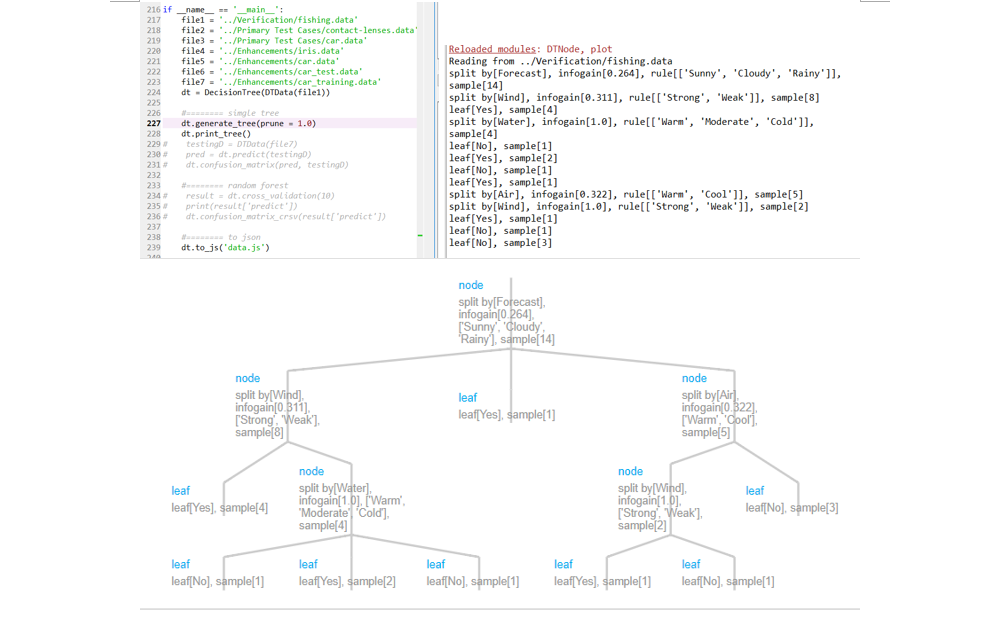
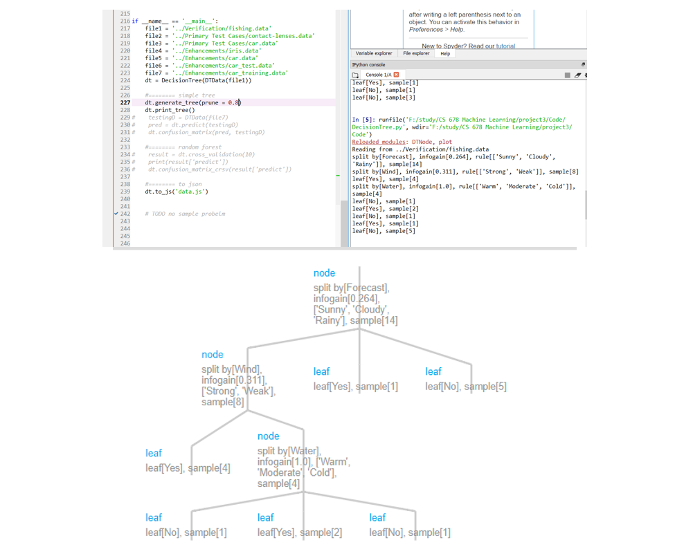

# Decision Tree Algorithm
Decision Trees Algorithm in Python

# Information-based Learning using Decision Trees

## Introduction

The main task of this project is to design an algorithm that accept a training dataset of labeled documents to generate a set of Decision Tree Classifiers to predict new inputs. The algorithm is implemented in Python language as processing algorithm, and JavaScript library (Treant.js [1]) as visualization method, by which I could build several different modules for scalability and reusability. Code of the modules are in Attachment. I only attach program generated tree in json format that can be imported to Treant to visualize but leave out the whole library code.

## Code and Program Demonstration

The main learning algorithm is ID3 which is listed below. The program uses DecisionTree to perform the main function of program operation (read file, generate data and tree, visualization, output files). DecisionTree first to read training data and generate root node, then call root.split() method to recursively generate children nodes. Inside split() method, it calculates information gain and verify if it is a leaf node based on the given condition (prune value, if the ratio of largest sample is larger than this threshold, then it is a leaf node.) DecisionTree also provides function like predict, plot confusion matrix, generate random forest (cross_validation()), and print tree as text or json format data for  Treant.js.

Inside split method, it verifies if the current attribute is categorial or continuous value (for example, attribute that is described as “real” in iris), it uses different algorithm to determine best split threshold.

DTdata is a module to save input data information, including samples, attributes and labels information, as an input for tree node to generate tree.

DTNode is a module as every node of decision tree, provides functions like split() to split current sample, to_string(), to_json() to visualize, predict() to recursively pass sample to predict the label, is_leaf() to verify if this node is a leaf node and stop spliting.

Currently it only uses information gain as the method to split samples. 

To see the tree visualization, use DecisionTree.to_js() output tree data to data.js file, then import it into Treant.js html page on the browser to see the plot. (Figure 1.1)

Main entrance is file “DecisionTree.py”.

Table 1 Important modules/functions demonstration

## Data Structure 
The program uses tree structure to represent decision tree and implemented by myself except JavaScript library Treant.js. 

## Algorithm Demonstration

### 1 Tree Generation

Figure1: ID3 algorithm.

### 2 Sample Split (DTNode.split())

### 3 Verification of Leaf Node

### 4 Pre-Prune
Use leaf verification function (DTNode.is_leaf()) to pre-prune the decision tree.

## Experiment Result and Compare

### 1 Fishing Data Training

Figure1.1: Fishing data training. Prune = 1.0

Figure 1.2: Fishing data training. Prune = 0.8
